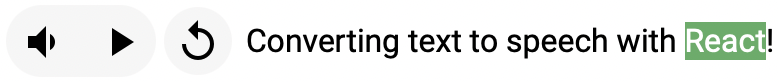

# [`tts-react`](https://www.npmjs.com/package/tts-react)




`tts-react` provides a hook (`useTts`) and component (`TextToSpeech`) to convert text to speech. In most cases you want the hook so you can use custom styling on the audio controls.

By default `tts-react` uses the [`SpeechSynthesis`](https://developer.mozilla.org/en-US/docs/Web/API/SpeechSynthesis) and [`SpeechSynthesisUtterance`](https://developer.mozilla.org/en-US/docs/Web/API/SpeechSynthesisUtterance) API's. You can fallback to the [`HTMLAudioElement`](https://developer.mozilla.org/en-US/docs/Web/HTML/Element/audio) API by providing a `fetchAudioData` prop to the hook or component.

## Install

`npm i react react-dom tts-react`

## Documentation

[morganney.github.io/tts-react](https://morganney.github.io/tts-react/)

## Example

#### Hook

```ts
import { useTts } from 'tts-react'
import type { TTSHookProps } from 'tts-react'

interface HookExampleProps extends TTSHookProps {
  highlight?: boolean
}

const HookExample = ({ children, highlight = false }: HookExampleProps) => {
  const { ttsChildren, state, onPlay, onStop, onPause } = useTts({
    children,
    markTextAsSpoken: highlight
  })

  return (
    <div>
      {state.isReady && (
        <>
          <button onClick={onPlay}>Play</button>
          <button onClick={onPause}>Pause</button>
          <button onClick={onStop}>Stop</button>
        </>
      )}
      {ttsChildren}
    </div>
  )
}

const App = () => {
  return <HookExample highlight>Some text to be spoken.</HookExample>
}
```

#### Component

```ts
import { TextToSpeech, Positions, Sizes } from 'tts-react'

const App = () => {
  return (
    <TextToSpeech
      markTextAsSpoken
      align="vertical"
      size={Sizes.SMALL}
      position={Positions.TL}>
      <p>Some text to be spoken.</p>
    </TextToSpeech>
  )
}
```

## `useTts`

The hook returns the internal state of the audio being spoken, getters/setters of audio attributes, callbacks that can be used to control playing/stopping/pausing/etc. of the audio, and modified `children` if using `markTextAsSpoken`. The parameters accepted are described in the [Props](#props) section. The response object is described by the `TTSHookResponse` type.

```ts
const useTts = ({
  lang,
  voice,
  children,
  markColor,
  markBackgroundColor,
  onError,
  onMuted,
  fetchAudioData,
  autoPlay = false,
  markTextAsSpoken = false
}: TTSHookProps): TTSHookResponse => {
  // ...
  return {
    get,
    set,
    state,
    spokenText,
    ttsChildren,
    onPlay,
    onStop,
    onPause,
    onReset,
    onPlayPause,
    onMuted: onMutedHandler
  }
}

interface TTSHookResponse {
  set: {
    lang: (value: string) => void
    rate: (value: number) => void
    pitch: (value: number) => void
    volume: (value: number) => void
    preservesPitch: (value: boolean) => void
  }
  get: {
    lang: () => string
    rate: () => number
    pitch: () => number
    volume: () => number
    preservesPitch: () => boolean
  }
  state: TTSHookState
  spokenText: string
  onPlay: () => void
  onStop: () => void
  onPause: () => void
  onReset: () => void
  onMuted: () => void
  onPlayPause: () => void
  ttsChildren: ReactNode
}
interface TTSHookState {
  boundary: BoundaryUpdate
  isPlaying: boolean
  isPaused: boolean
  isMuted: boolean
  isError: boolean
  isReady: boolean
}
interface TTSBoundaryUpdate {
  word: string
  startChar: number
  endChar: number
}
```

## `fetchAudioData`

Using `fetchAudioData` will bypass `SpeechSynthesis` and use the `HTMLAudioElement`.

```ts
(spokenText: string) => Promise<TTSAudioData>
```

When using `fetchAudioData` it must return `TTSAudioData` which has the following shape:

```ts
interface PollySpeechMark {
  end: number
  start: number
  time: number
  type: 'word'
  value: string
}
interface TTSAudioData {
  audio: string
  marks?: PollySpeechMark[]
}
```
The `audio` property must be a URL that can be applied to [`HTMLAudioElement.src`](https://developer.mozilla.org/en-US/docs/Web/HTML/Element/audio#attr-src), including a [data URL](https://developer.mozilla.org/en-US/docs/Web/HTTP/Basics_of_HTTP/Data_URLs). If using `markTextAsSpoken` then you must also return the `marks` that describe the word boundaries. `SpeechMarks` have the same shape as the [Speech Marks used by Amazon Polly](https://docs.aws.amazon.com/polly/latest/dg/speechmarks.html), with the restriction that they must be of `type: 'word'`.


## Props

Most of these are supported by the `useTts` hook, but those marked with an asterisk are exclusive to the `TextToSpeech` component.

<sub>`*` Only applies to `TextToSpeech` component.</sub>

|Name|Required|Type|Default|Description|
|----|--------|----|-------|-----------|
|children|yes|`ReactNode`|none|Provides the text that will be spoken.|
|lang|no|`string`|The one used by [`SpeechSynthesisUtterance.lang`](https://developer.mozilla.org/en-US/docs/Web/API/SpeechSynthesisUtterance/lang).|Sets the [`SpeechSynthesisUtterance.lang`](https://developer.mozilla.org/en-US/docs/Web/API/SpeechSynthesisUtterance/lang). Overrides `voice` when set and `voice.lang` does not match `lang`.|
|voice|no|`SpeechSynthesisVoice`|None or the voice provided by `audio` from `TTSAudioData`.|The voice heard when the text is spoken. Calling `set.lang` may override this value.|
|autoPlay|no|`boolean`|`false`|Whether the audio of the text should automatically be spoken when ready.|
|markTextAsSpoken|no|`boolean`|`false`|Whether the word being spoken should be highlighted.|
|markColor|no|`string`|none|Color of the text that is currently being spoken. Only applies with `markTextAsSpoken`.|
|markBackgroundColor|no|`string`|none|Background color of the text that is currently being spoken. Only applies with `markTextAsSpoken`.|
|fetchAudioData|no|`(text: string) => Promise<TTSAudioData>`|none|Function to return the optional `SpeechMarks[]` and `audio` URL for the text to be spoken. See [fetchAudioData](#fetchaudiodata) for more details.|
|<sup>`*`</sup>allowMuting|no|`boolean`|`true`|Whether an additional button will be shown on the component that allows muting the audio. Calls `onMuted` when clicked.|
|onMuted|no|`(wasMuted: boolean) => void`|none|Callback when the user clicks the mute button shown from `allowMuting` being enabled. Can be used to toggle global or local state like whether `autoPlay` should be enabled.|
|onError|no|`(evt: CustomEvent<string>) => void`|none|Callback when there is an error of any kind playing the spoken text. The error message (if any) will be provided in `evt.detail`.|
|<sup>`*`</sup>align|no|`'horizontal' \| 'vertical'`|`'horizontal'`|How to align the controls within the `TextToSpeech` component.|
|<sup>`*`</sup>size|no|`'small' \| 'medium' \| 'large'`|`'medium'`|The relative size of the controls within the `TextToSpeech` component.|
|<sup>`*`</sup>position|no|`'topRight' \| 'topLeft' \| 'bottomRight' \| 'bottomLeft'`|`'topRight'`|The relative positioning of the controls within the `TextToSpeech` component.|


## FAQs

<details>
<summary>Why does <code>markTextAsSpoken</code> not work on Chrome for Android?</summary>
<p>This is a known issue by the Chromium team that apparently they are <a href="https://bugs.chromium.org/p/chromium/issues/detail?id=521666#c7" target="_blank">not going to fix</a>. You can use <code>fetchAudioData</code> to fallback to the <code>HTMLAudioElement</code>, or try a different browser.</p>
</details>

<details>
<summary>Why can I not pause the audio when using <code>SpeechSynthesis</code> on Firefox for Android?</summary>
<p>See the compat table on MDN for <a href="https://developer.mozilla.org/en-US/docs/Web/API/SpeechSynthesis/pause#browser_compatibility" target="_blank">SpeechSynthesis.pause()</a>.</p>
<p><blockquote>In Android, pause() ends the current utterance. pause() behaves the same as cancel().</blockquote></p>
<p>You can use the hook <code>useTts</code> to build custom controls that <strong>do not</strong> expose a pause, but only stop.</p>
</details>
