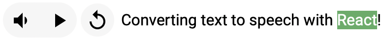

# [`tts-react`](https://www.npmjs.com/package/tts-react)


[](https://codecov.io/gh/morganney/tts-react)
[](https://www.npmjs.com/package/tts-react)



`tts-react` provides a hook (`useTts`) and component (`TextToSpeech`) to convert text to speech. In most cases you want the hook so you can use custom styling on the audio controls.

By default `tts-react` uses the [`SpeechSynthesis`](https://developer.mozilla.org/en-US/docs/Web/API/SpeechSynthesis) and [`SpeechSynthesisUtterance`](https://developer.mozilla.org/en-US/docs/Web/API/SpeechSynthesisUtterance) API's. You can fallback to the [`HTMLAudioElement`](https://developer.mozilla.org/en-US/docs/Web/HTML/Element/audio) API by providing a `fetchAudioData` prop to the hook or component.

## Install

```console
npm i react react-dom tts-react
```

For projects using React 18:

```console
npm i react@18 react-dom@18 tts-react@3
```

## Demo (Storybook)

[morganney.github.io/tts-react](https://morganney.github.io/tts-react/)

## Example

#### ESM + CDN

Get up and running quickly using `tts-react` with ESM from a CDN. This example uses [React 19](https://react.dev/blog/2024/04/25/react-19) with [`htm`](https://github.com/developit/htm):

```html
<!doctype html>
<html lang="en">
  <head>
    <meta charset="UTF-8" />
    <meta name="viewport" content="width=device-width, initial-scale=1.0" />
    <title>ESM + CDN + htm</title>
  </head>
  <body>
    <script type="module">
      import { createElement } from 'https://esm.sh/react'
      import { createRoot } from 'https://esm.sh/react-dom/client'
      import { TextToSpeech } from 'https://esm.sh/tts-react'
      import htm from 'https://esm.sh/htm'

      const html = htm.bind(createElement)

      createRoot(document.body).render(
        html`
          <${TextToSpeech} markTextAsSpoken>
            <p>Hello from tts-react.</p>
          </${TextToSpeech}>
        `
      )
    </script>
  </body>
</html>
```

#### Hook

You can use the hook to create a `Speak` component that converts the text to speech on render:

```tsx
import { useTts } from 'tts-react'
import type { TTSHookProps } from 'tts-react'

type SpeakProps = Pick<TTSHookProps, 'children'>

const Speak = ({ children }: SpeakProps) => (
  <>{useTts({ children, autoPlay: true }).ttsChildren}</>
)

const App = () => {
  return (
    <Speak>
      <p>This text will be spoken on render.</p>
    </Speak>
  )
}
```

Or create a more advanced component with controls for adjusting the speaking:

```tsx
import { useTts } from 'tts-react'
import type { TTSHookProps } from 'tts-react'

interface CustomProps extends TTSHookProps {
  highlight?: boolean
}

const CustomTTSComponent = ({ children, highlight = false }: CustomProps) => {
  const { ttsChildren, state, play, stop, pause } = useTts({
    children,
    markTextAsSpoken: highlight
  })

  return (
    <div>
      <>
        <button disabled={state.isPlaying} onClick={play}>
          Play
        </button>
        <button disabled={!state.isPlaying} onClick={pause}>
          Pause
        </button>
        <button onClick={stop}>Stop</button>
      </>
      {ttsChildren}
    </div>
  )
}

const App = () => {
  return (
    <CustomTTSComponent highlight>
      <p>Some text to be spoken and highlighted.</p>
    </CustomTTSComponent>
  )
}
```

#### Component

Use the `TextToSpeech` component for an out of the box solution:

```tsx
import { TextToSpeech, Positions, Sizes } from 'tts-react'

const App = () => {
  return (
    <TextToSpeech
      markTextAsSpoken
      align="vertical"
      size={Sizes.SMALL}
      position={Positions.TL}>
      <p>Some text to be spoken.</p>
    </TextToSpeech>
  )
}
```

## `useTts`

The hook returns the internal state of the audio being spoken, getters/setters of audio attributes, callbacks that can be used to control playing/stopping/pausing/etc. of the audio, and modified `children` if using `markTextAsSpoken`. The parameters accepted are described in the [Props](#props) section. The response object is described by the `TTSHookResponse` type.

```ts
const {
  get,
  set,
  state,
  spokenText,
  ttsChildren,
  play,
  stop,
  pause,
  replay,
  playOrPause,
  playOrStop,
  toggleMute,
  isBrowserSupportsSpeechSynthesis
} = useTts({
  lang,
  voice,
  children,
  autoPlay,
  markTextAsSpoken,
  markColor,
  markBackgroundColor,
  onStart,
  onBoundary,
  onPause,
  onEnd,
  onError,
  onNotSupported,
  onVolumeChange,
  onPitchChange,
  onRateChange,
  fetchAudioData
})

interface TTSHookProps extends MarkStyles {
  /** The spoken text is extracted from here. */
  children: ReactNode
  /** The `SpeechSynthesisUtterance.lang` to use. */
  lang?: string
  /** The `SpeechSynthesisUtterance.voice` to use. */
  voice?: SpeechSynthesisVoice
  /** The initial rate of the speaking audio. */
  rate?: number
  /** The initial volume of the speaking audio. */
  volume?: number
  /** Whether the text should be spoken automatically, i.e. on render. */
  autoPlay?: boolean
  /** Whether the spoken word should be wrapped in a `<mark>` element. */
  markTextAsSpoken?: boolean
  /** Callback when the volume is changed.  */
  onVolumeChange?: (newVolume: number) => void
  /** Callback when the rate is changed.  */
  onRateChange?: (newRate: number) => void
  /** Callback when the pitch is changed.  */
  onPitchChange?: (newPitch: number) => void
  /** Callback when there is an error of any kind. */
  onError?: (msg: string) => void
  /** Callback when the utterance/synthesis is not supported. */
  onNotSupported?: (msg: string) => void
  /** Callback when speaking/audio starts playing. */
  onStart?: (evt: SpeechSynthesisEvent | Event) => void
  /** Callback when the speaking/audio is paused. */
  onPause?: (evt: SpeechSynthesisEvent | Event) => void
  /** Calback when the current utterance/audio has ended. */
  onEnd?: (evt: SpeechSynthesisEvent | Event) => void
  /** Callback when a word boundary/mark has been reached. */
  onBoundary?: (evt: SpeechSynthesisEvent | Event) => void
  /** Function to fetch audio and speech marks for the spoken text. */
  fetchAudioData?: (spokenText: string) => Promise<TTSAudioData>
}
interface TTSHookResponse {
  set: {
    lang: (value: string) => void
    rate: (value: number) => void
    pitch: (value: number) => void
    volume: (value: number) => void
    preservesPitch: (value: boolean) => void
  }
  get: {
    lang: () => string
    rate: () => number
    pitch: () => number
    volume: () => number
    preservesPitch: () => boolean
  }
  /** State of the current speaking/audio. */
  state: TTSHookState
  /** The text extracted from the children elements and used to synthesize speech. */
  spokenText: string
  play: () => void
  stop: () => void
  pause: () => void
  replay: () => void
  /** Toggles between muted/unmuted, i.e. volume is zero or non-zero. */
  toggleMute: (callback?: (wasMuted: boolean) => void) => void
  /** Toggles between play/stop. */
  playOrStop: () => void
  /** Toggles between play/pause. */
  playOrPause: () => void
  /** The original children with a possible <mark> included if using `markTextAsSpoken`. */
  ttsChildren: ReactNode
  /** Whether the current browser supports speech synthesis. */
  isBrowserSupportsSpeechSynthesis: boolean
}
interface TTSHookState {
  voices: SpeechSynthesisVoice[]
  boundary: BoundaryUpdate
  isPlaying: boolean
  isPaused: boolean
  isMuted: boolean
  isError: boolean
  isReady: boolean
}
interface TTSBoundaryUpdate {
  word: string
  startChar: number
  endChar: number
}
```

## `fetchAudioData`

Using `fetchAudioData` will bypass `SpeechSynthesis` and use the `HTMLAudioElement`.

```ts
;(spokenText: string) => Promise<TTSAudioData>
```

When using `fetchAudioData` it must return `TTSAudioData` which has the following shape:

```ts
interface PollySpeechMark {
  end: number
  start: number
  time: number
  type: 'word'
  value: string
}
interface TTSAudioData {
  audio: string
  marks?: PollySpeechMark[]
}
```

The `audio` property must be a URL that can be applied to [`HTMLAudioElement.src`](https://developer.mozilla.org/en-US/docs/Web/HTML/Element/audio#attr-src), including a [data URL](https://developer.mozilla.org/en-US/docs/Web/HTTP/Basics_of_HTTP/Data_URLs). If using `markTextAsSpoken` then you must also return the `marks` that describe the word boundaries. `PollySpeechMarks` have the same shape as the [Speech Marks used by Amazon Polly](https://docs.aws.amazon.com/polly/latest/dg/speechmarks.html), with the restriction that they must be of `type: 'word'`.

## Props

Most of these are supported by the `useTts` hook, but those marked with an asterisk are exclusive to the `TextToSpeech` component.

<sub>`*` Only applies to `TextToSpeech` component.</sub>

| Name                           | Required | Type                                                                        | Default                                                                                                                            | Description                                                                                                                                                                                    |
| ------------------------------ | -------- | --------------------------------------------------------------------------- | ---------------------------------------------------------------------------------------------------------------------------------- | ---------------------------------------------------------------------------------------------------------------------------------------------------------------------------------------------- |
| children                       | yes      | `ReactNode`                                                                 | none                                                                                                                               | Provides the text that will be spoken.                                                                                                                                                         |
| lang                           | no       | `string`                                                                    | The one used by [`SpeechSynthesisUtterance.lang`](https://developer.mozilla.org/en-US/docs/Web/API/SpeechSynthesisUtterance/lang). | Sets the [`SpeechSynthesisUtterance.lang`](https://developer.mozilla.org/en-US/docs/Web/API/SpeechSynthesisUtterance/lang). Overrides `voice` when set and `voice.lang` does not match `lang`. |
| voice                          | no       | `SpeechSynthesisVoice`                                                      | None or the voice provided by `audio` from `TTSAudioData`.                                                                         | The voice heard when the text is spoken. Calling `set.lang` may override this value.                                                                                                           |
| autoPlay                       | no       | `boolean`                                                                   | `false`                                                                                                                            | Whether the audio of the text should automatically be spoken when ready.                                                                                                                       |
| markTextAsSpoken               | no       | `boolean`                                                                   | `false`                                                                                                                            | Whether the word being spoken should be highlighted.                                                                                                                                           |
| markColor                      | no       | `string`                                                                    | none                                                                                                                               | Color of the text that is currently being spoken. Only applies with `markTextAsSpoken`.                                                                                                        |
| markBackgroundColor            | no       | `string`                                                                    | none                                                                                                                               | Background color of the text that is currently being spoken. Only applies with `markTextAsSpoken`.                                                                                             |
| fetchAudioData                 | no       | `(text: string) => Promise<TTSAudioData>`                                   | none                                                                                                                               | Function to return the optional `SpeechMarks[]` and `audio` URL for the text to be spoken. See [fetchAudioData](#fetchaudiodata) for more details.                                             |
| <sup>`*`</sup>allowMuting      | no       | `boolean`                                                                   | `true`                                                                                                                             | Whether an additional button will be shown on the component that allows muting the audio.                                                                                                      |
| <sup>`*`</sup>onMuteToggled    | no       | `(wasMuted: boolean) => void`                                               | none                                                                                                                               | Callback when the user clicks the mute button shown from `allowMuting` being enabled. Can be used to toggle global or local state like whether `autoPlay` should be enabled.                   |
| onStart                        | no       | `(evt: SpeechSynthesisEvent \| Event) => void`                              | none                                                                                                                               | Callback when the speaking/audio has started (or resumed) playing.                                                                                                                             |
| onPause                        | no       | `(evt: SpeechSynthesisEvent \| Event) => void`                              | none                                                                                                                               | Callback when the speaking/audio has been paused.                                                                                                                                              |
| onEnd                          | no       | `(evt: SpeechSynthesisEvent \| Event) => void`                              | none                                                                                                                               | Callback when the speaking/audio has stopped.                                                                                                                                                  |
| onBoundary                     | no       | `(boundary: TTSBoundaryUpdate, evt: SpeechSynthesisEvent \| Event) => void` | none                                                                                                                               | Callback when a word boundary/mark has been reached.                                                                                                                                           |
| onError                        | no       | `(msg: string) => void`                                                     | none                                                                                                                               | Callback when there is an error of any kind playing the spoken text. The error message (if any) will be provided.                                                                              |
| onNotSupported                 | no       | `(msg: string) => void`                                                     | none                                                                                                                               | Callback when the utterance/synthesis is not supported in browser.                                                                                                                             |
| onVolumeChange                 | no       | `(newVolume: number) => void`                                               | none                                                                                                                               | Callback when the volume has changed.                                                                                                                                                          |
| onRateChange                   | no       | `(newRate: number) => void`                                                 | none                                                                                                                               | Callback when the rate has changed.                                                                                                                                                            |
| onPitchChange                  | no       | `(newPitch: number) => void`                                                | none                                                                                                                               | Callback when the pitch has changed.                                                                                                                                                           |
| <sup>`*`</sup>align            | no       | `'horizontal' \| 'vertical'`                                                | `'horizontal'`                                                                                                                     | How to align the controls within the `TextToSpeech` component.                                                                                                                                 |
| <sup>`*`</sup>size             | no       | `'small' \| 'medium' \| 'large'`                                            | `'medium'`                                                                                                                         | The relative size of the controls within the `TextToSpeech` component.                                                                                                                         |
| <sup>`*`</sup>position         | no       | `'topRight' \| 'topLeft' \| 'bottomRight' \| 'bottomLeft'`                  | `'topRight'`                                                                                                                       | The relative positioning of the controls within the `TextToSpeech` component.                                                                                                                  |
| <sup>`*`</sup>useStopOverPause | no       | `boolean`                                                                   | `false`                                                                                                                            | Whether the controls should display a stop button instead of a pause button. On Android devices, `SpeechSynthesis.pause()` behaves like `cancel()`, so you can use this prop in that context.  |

## FAQ

<details>
<summary>Why does speaking sometimes stop prematurely around 255 characters?</summary>
<p>This is independent of <code>tts-react</code> and will happen if you are using the <code>SpeechSynthesis</code> Web Speech API on a platform that only provides network-based <code>SpeechSynthesisVoice</code>s. See the <a href="https://github.com/morganney/tts-react/issues/63">associated issue</a> for more details. Unfortunately, all you can really do is try another platform that has local voices installed.</p>
</details>

<details>
<summary>Why is text inside child components not being spoken?</summary>
<p>Due to the way <a href="https://react.dev/reference/react/Children#children-map-caveats"><code>Children.map</code></a> works</p>
<blockquote>
<p><strong>The traversal does not go deeper than React elements:</strong> they don't get rendered, and their children aren't traversed.</p>
</blockquote>
<p><code>tts-react</code> can not extract the text from child components. Instead, include the text as a <strong>direct</strong> child of <code>TextToSpeech</code> (or <code>useTts</code>).</p>
</details>

<details>
<summary>Why does <code>markTextAsSpoken</code> sometimes highlight the wrong word?</summary>
<p>The <a href="https://developer.mozilla.org/en-US/docs/Web/API/SpeechSynthesisUtterance/boundary_event"><code>SpeechSynthesisUtterance</code> boundary event</a> <em>may</em> fire with skewed word boundaries for certain combinations of <code>spokenText</code> and <code>lang</code> or <code>voice</code> props. If you check the value of <code>state.boundary.word</code> in these cases, you will find the event is firing at unexpected boundaries, so there is no real solution other than to find a suitable <code>voice</code> for your given <code>spokenText</code>.</p>
</details>

<details>
<summary>Why does <code>markTextAsSpoken</code> not work on Chrome for Android or Linux?</summary>
<p>This is a known issue by the Chromium team that apparently they are <a href="https://bugs.chromium.org/p/chromium/issues/detail?id=521666#c7" target="_blank">not going to fix</a>. There is <a href="https://stackoverflow.com/questions/75177288/onboundary-event-doesnt-fire-in-chrome-on-ubuntu-20-04-and-above/77889844#77889844">no <code>boundary</code> event fired on platforms that only support network-based voices</a>. You can use <code>fetchAudioData</code> to fallback to the <code>HTMLAudioElement</code>, or try a different browser/OS.</p>
</details>

<details>
<summary>Why can I not pause the audio when using <code>SpeechSynthesis</code> on Firefox and Chrome for Android?</summary>
<p>See the compat table on MDN for <a href="https://developer.mozilla.org/en-US/docs/Web/API/SpeechSynthesis/pause#browser_compatibility" target="_blank">SpeechSynthesis.pause()</a>.</p>
<p><blockquote>In Android, pause() ends the current utterance. pause() behaves the same as cancel().</blockquote></p>
<p>You can use the hook <code>useTts</code> to build custom controls that <strong>do not</strong> expose a pause, but only stop. If using the <code>TextToSpeech</code> component use the <code>useStopOverPause</code> prop for Android devices.</p>
</details>

<details>
<summary>Why is text from <code>dangerouslySetInnerHTML</code> not spoken?</summary>
<p><code>tts-react</code> does not speak text from <code>dangerouslySetInnerHTML</code>. Instead convert your HTML string into React elements via an html-to-react parser. See this <a href="https://morganney.github.io/tts-react/?path=/story/tts-react--dangerously-set-inner-html">example</a>.</p>
</details>

<details>
<summary>What's up with Safari?</summary>
<p>Safari is becoming the new IE, and simply does not follow the spec completely (yet). As one example, Safari 15.6.1 on macOS Monterey 12.5.1, throws a <code>SpeechSynthesisEvent</code> during a <a href="https://developer.mozilla.org/en-US/docs/Web/API/SpeechSynthesisUtterance/error_event"><code>SpeechSynthesisUtterance.error</code></a>, while the spec says errors against utterances <a href="https://wicg.github.io/speech-api/#utterance-events">"must use the SpeechSynthesisErrorEvent interface"</a>.</p>
</details>
